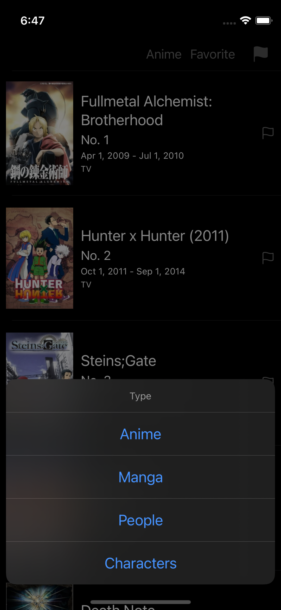
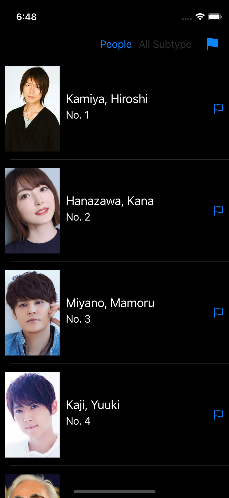

# Jikan Top items iOS App

This is a quick demo to show Anime/Manga Top rank items via Jikan API

## Features

- Auto load 50 more items while scroll to bottom
- User can tap on flag icon to mark as favorite, or un-flag via tap it again
- User view all flaged items by tapping on the top-right button
- App will keep flag items in local storage
- User can view details in web view

## Demo

| Anime/Manga                    | People/Character                 |
| ------------------------------ | -------------------------------- |
|  |  |

Please also refer to demo video here

https://cln.sh/4iHXN1

## Prerequisites 

- Xcode 13.x 

- macOS BigSur

## Dependencies

- RxSwift + Comunities extensions
- SwiftyUserDefaults
- Moya
- Kingfisher
- SnapKit
- ProgressHUD